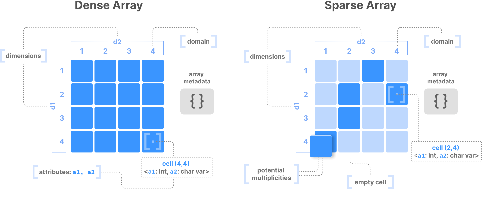
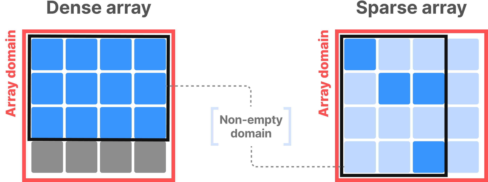
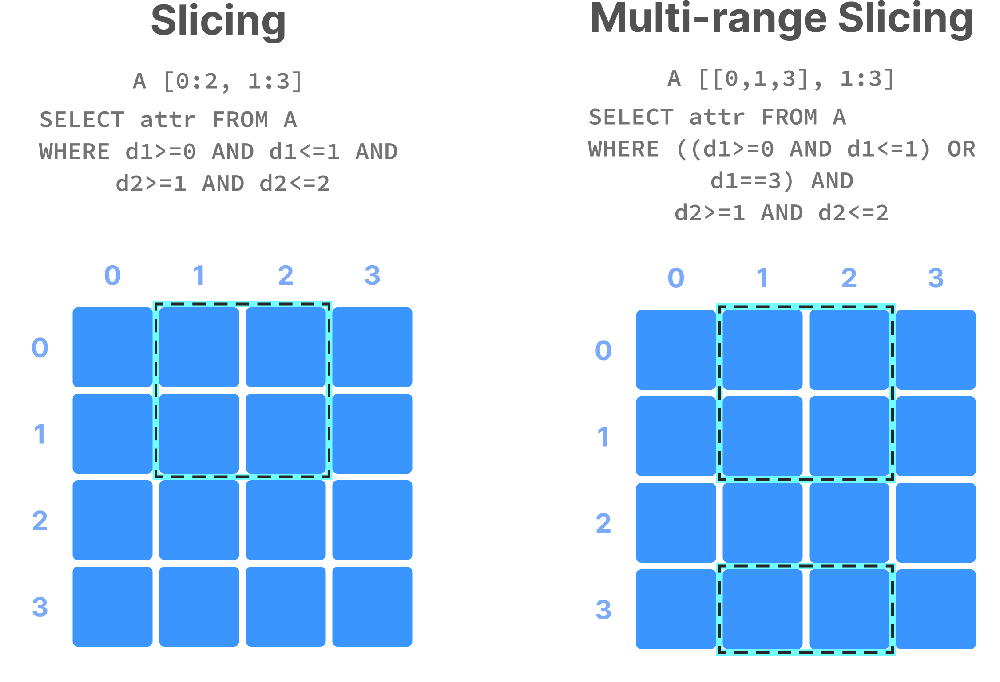
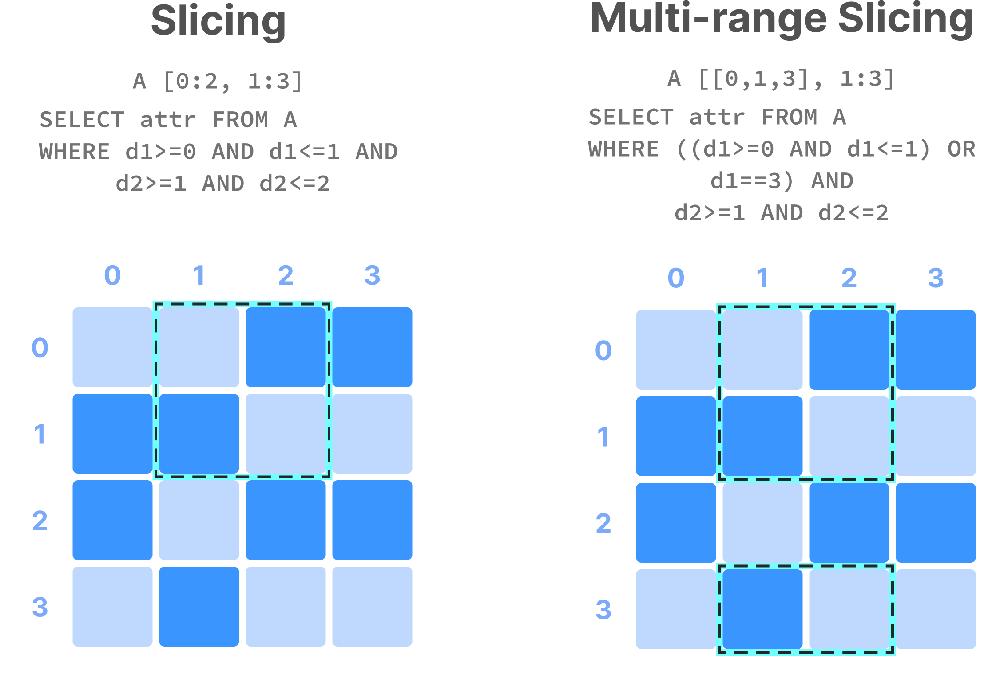

# TileDB Array Model
#tiledb #arrays #dense #sparse #dimensions #attributes

TileDB is architected around multi-dimensional arrays,
and therefore the array is a first-class citizen in TileDB.

There is an important distinction between dense and sparse arrays.



## Dimensions

An array can have any number of _dimensions_.
In theory these are measurable directions/indices; collections of elements.
You can consider these as the fields receive the majority of query conditions.
TileDB is designed to performance range search on these very fast.

Dimensions also define the cell coordinates in sparse arrays.

### Dimension types

Roughly, the types supported in Python are:
- `"ascii"` (sparse only) for variable-length string
- Signed NumPy ints, e.g. `np.int32`
- Unsigned NumPy ints, e.g.` np.uint64`
- NumPy floats (sparse only), `np.float32`
- `"datetime64[T]` where `T` is a unit of time.

In C/C++/Go these same types are available as, e.g.,
- `TILEDB_STRING_ASCII` (sparse only)jjj
- `TILEDB_UINT32`
- `TILEDB_DATETIME_SEC`
- etc.

## Attributes

Dimensions differ from _attributes_ which define the values inside
multi-dimensional cells.

An array may have multiple attributes,
which means every (non-empty) cell can store multiple values,
potentially of different types.

TileDB stores values of each attr across all cells in separate files,
i.e. it follows the so-called columnar format.
Beneficial for several reasons, two of which are:
- Each file contains values of same type, potentially similar to one another,
  leading to more efficient compression.
- Queries that subselect over attrs do not need to fetch values of irrelevent
  attributes from storage at all. Signficantly boosts performance.

### Fixed-length attributes

A cell along a fixed-length attributes takes either:
- a single value of a defined basic type (e.g. `int32`) 
- or a fixed, pre-specified number of values of same defined basic data type
  (e.g. three `int32` values such as `1,2,3`)

In both cases, each cell value along a fixed-length attribute
consumes the same size in bytes.

### Variable-length attributes

Attributes with data of varying length, such as strings and lists of basic
data type values of different sizes for each cell.

Two files are stored for each variable-length attr.
1. Serializes all values of non-empty cells of the attr
2. Stores starting offsets (in bytes) of each cell value in the first file.

For example, if ASCII string attr stores `"a", "bb", "ccc"`,
then first file contains `abbccc` and second contains `0, 1, 3` in bytes.

### Attribute types

Python C/C++/Go types are likewise the same, but additionally we have:
- `np.dtype('U')` for UTF-8 strings
- `TILEDB_BLOB` for opaque bytes (no query conditions supported)

Another noticeable difference: these extend to both dense and sparse arrays!

## Cells

Cells are the atomic unit of an array.
It's defined by the coordinate values of the array dimensions,
and may contain one or more attribute values.

For sparse arrays, there may be cell multiplicities:
two cells with the same exact coordinates.

The cells obey a global order, defined by various array parameters
upon array creation.
This further dictates the way cell attr values are stored in array files.

## Domains

This term refers to either:
- The domain of a particular dimension, which defines permissible values 
  for cell coordinates on that dimension
- All dimensions and their domains collectively, which define
  where multi-dimensional cells can be created.

Here we refer to the latter. 

In dense arrays, domain must consist of dimensions of same basic data type.
Domain of each dimension can take negative values as well (if signed).
whereas the domain range can start from non-zero value.
E.g. dimension domains `[-2, 10]` and `[20, 30]` are both valid.

In sparse arrays, dimensions can be of different data types.
Additionally sparse arrays can have floating point or string dimensions.
And sparse arrays may have cell multiplicities.

When an array is created, no matter how small/large its domain,
TileDB does not materialize any cell value.
Can make multiple writes and populate different parts (subarrays) at any time.
This means user can populate array incrementally.

The tightest hyper-rectangle that contains non-empty cells
is called the _non-empty domain_.
It's useful for various optimizations in ingestion/reading operations.



## Tiles

A tile is a group of cells serving as the atomic unit of I/O and compression.

TileDB differentiates between the following tile definitions:

### Space and Data tiles

Space tiles are
defined upon array creation by specifying a _tile extent_ per dimension.
The extent partitions the dimension domain into equal segments.
There's no offsets, its just equal chunks from start onwards.

Data tiles are
the actual collection of data values included in the tile 
and materialized on storage.

In dense arrays, space and data tiles are equivalent.

In sparse arrays, they may differ:
space tiles define overall data layout that sorts data values on storage,
but may contain empty cells that are not materialized.
Data tile is defined after data is sorted, and is determined by _capacity_ param.

All data tiles in both dense and sparse arrays have the same _capacity_,
i.e. the same number of non-empty cells.
In dense arrays, capacity is inferred by space tile,
In sparse, the user specifies the capacity explicitly upon array creation


### Logical and Physical tiles

Additional terminology. 

Logical tiles (either space or data tiles) refer to multi-dim cells of array,
regardless of how many attribute values each contains 
or how these are laid out in storage.

Physical tiles are data tiles, always corresponding to stored cell values
across a specific attribute. This is the actual atomic unit of I/O and compression.

### Fill values

A user can populate a TileDB array partially or incrementally.
Therefore, following scenarios are possible for dense arrays:
- tile may be partially written
- tile may be partially outside the array domain
- an empty tile may be read

In these cases, TileDB may need to:
write special fill values to indicate empty cells.
and similarly, return fill values for a query asking for unpopulated tiles.

Examples:
[Fill value examples](./_imgs/tiledb-fill-values-figure-light.png)

For blob/string types, the default fill value is `0`.
For signed int it's the minimum value.
For unsigned int it's the maximum value.
For float it's `NaN`.
For datetime it's the minimum int64 value.

Note: In the case that a fixed-size attr stores more than one value,
cell values will be assigned the default value corresponding to their type.

## Dense arrays

A _dense_ array can have any number of dimensions.
Each dimension must have a _domain_ with integer values,
and all dimensions must have the same data type.

An _array element_, aka _cell_, is defined by unique set of dimension coords.
In a dense array, all cells must store a value.
A logical cell can store more than 1 value of potentially different types.

An _attribute_ defines a collection of values with same type across all cells.

A dense array may be associated with set of arbitrary key-value pairs, called
_array metadata.

## Sparse arrays

A sparse array is very similar but has three important differences:
1. cells can be empty
2. dimensions can have heterogeneous types, including float and strings,
   i.e. the _domain_ can be "infinite"
3. cell multiplicities (i.e. cells w/ same dimension coords) are allowed

## Considerations

### Dense vs. Sparse
[Dense vs. Sparse](https://documentation.cloud.tiledb.com/academy/structure/arrays/tutorials/performance/dense-vs-sparse/index.html)

The decision on whether to model your data with dense or sparse arrays
depends on the application, and it can greatly affect performance.

Dense arrays don't materialize coordinates of cells,
allowing them to use more lightweight internal indexing during read queries.

Choose this type when the majority of cells are nonempty/nonzero/not null.
Benefits:
1. Less storage consumption; no cell coords and no large indexes needed.
2. Faster slicing queries; dense data layouts and lightweight indexing.

Sparse arrays materialize coords of cells and use more sophisticated,
multi-dimensional indexing as compared to dense arrays.

Choose when majority of cells are empty, zero, or null ("non-existent").
Benefits:
1. Less storage consumption; no recording values for non-existent cells
2. Faster slicing queries in sparse datasets with unknown distributes;
   TileDB takes advantage of advanced, multi-dimensional indexes.between

### Dimensions vs. Attributes
[Dimensions vs. Attributes](https://documentation.cloud.tiledb.com/academy/structure/arrays/tutorials/performance/dimensions-vs-attributes/)

Extra care should be taken when choosing to model a data field as
a dimension or an attrbute.

(querying dims more optimal than attrs)
Array systems are optimized for rapidly performing range conditions
on dimension coordinaties.
They can also support efficient conditions on attributes,
but by design, the most optimized selection performance comes from querying
on dimensions (reason explained later)

Good guidline that apply to both sparse and dense arrays:
If you often perform range slicing over a field or column of dataset,
you shoud consider making it a dimension.

Biggest strengths of array data systems:
- Can calibrate layout of multi-dimensional cells in 1D storage medium
- Can build efficient multi-dimensional indexes on top of cell coords
- Can optimize multi-dimensional range queries (slicing) by leveraging
  what they known about cell layout and indexes

Use a dimension for fields that receive frequent range queries. Examples:
- width and height of image
- width, length, and time of a video
- time and stock symbol in stock market tick dataset
- longitude, latitute, elevation in point clouds
- sample, chromosome, and position in variant dataset

If workloads aggregate or non-range filter queries on particular fields,
or if you're uncertain if a field will be used in a query condition,
then make that field an attribute.

TileDB has optimizations for filters and aggregates on attributes as well,
so performance will be great as well.
However, make sure to follow guideline if the majority of the time
you're applying a range condition on that field.

#### How many dimensions?

Depends on workloads and more specifically, how many dataset fields receive
frequent range query conditions.

Increasing number of dims may increase query selectivity
if they all receive range conditions,
as this strengthens the pruning power of internal multi-dim indexes,
leading to faster queries.

Increasing number of dims results in diminishing returns,
as the complexity of internal indexes increases,
and spatial locality of the results is lost.

A good idea to test is to make the most selective fields (largest pruning power)
as dimensions, and keep the rest as attributes that can receive extra
filtering conditions that TileDB can efficiently process as well.

## Slicing

Range conditions on dimensions are often called _slicing_.
The results constitute a "slice" or "subarray".

In NumPy notation, `A[0:2, 1:3]` is a slice consisting of values of cells
with coords `0` and `1` on first dimension,
and coords `1` and `2` on second dimension (assuming single attribute).
Alternatively, the equivalent SQL is:
```sql
SELECT attr FROM A WHERE d1>=0 AND d1<=1 AND d2>=1 AND d2<=2

```
Note: slicing may contain >1 range per dimension: multi-range slice.

Dense slicing:

Sparse slicing is the same, but results differ depending on missing data:


## Takeaways

A great advantage of the array model is that it can shapeshift and adapt
to any problem setting with even the most complex data.

