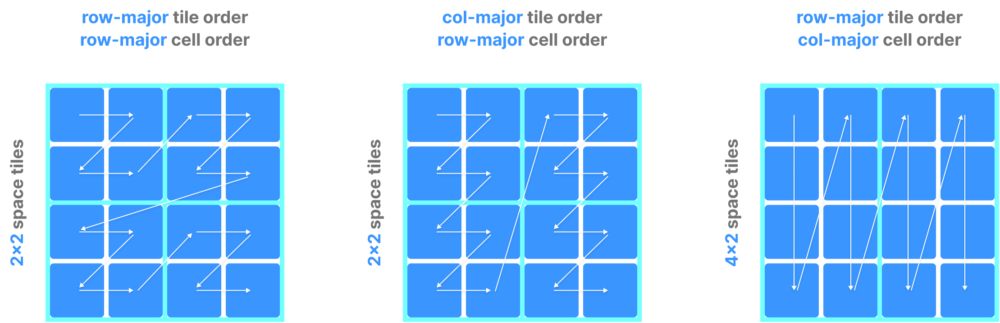
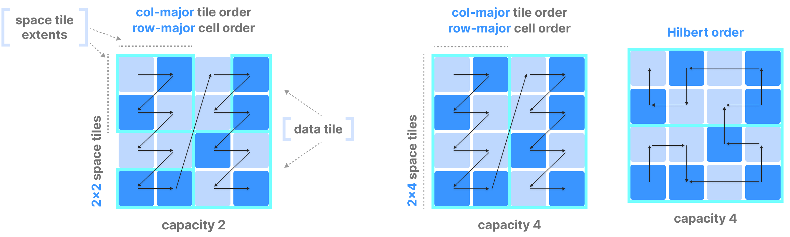
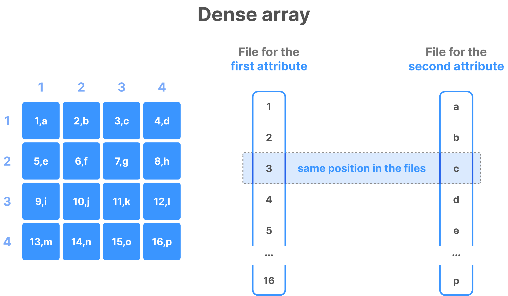
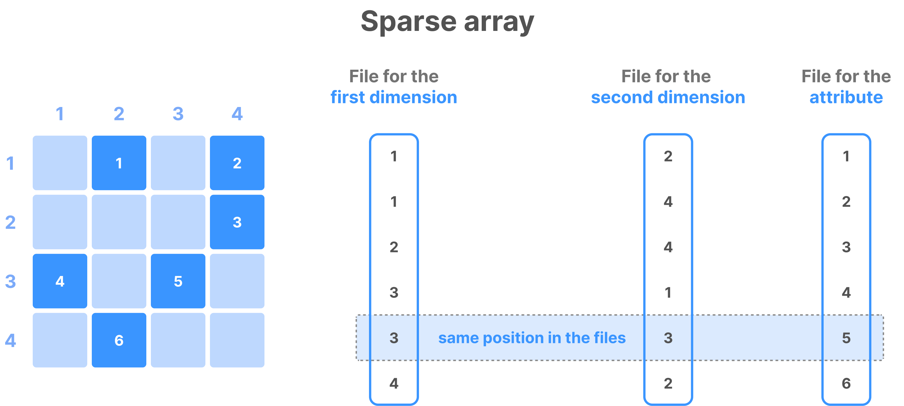
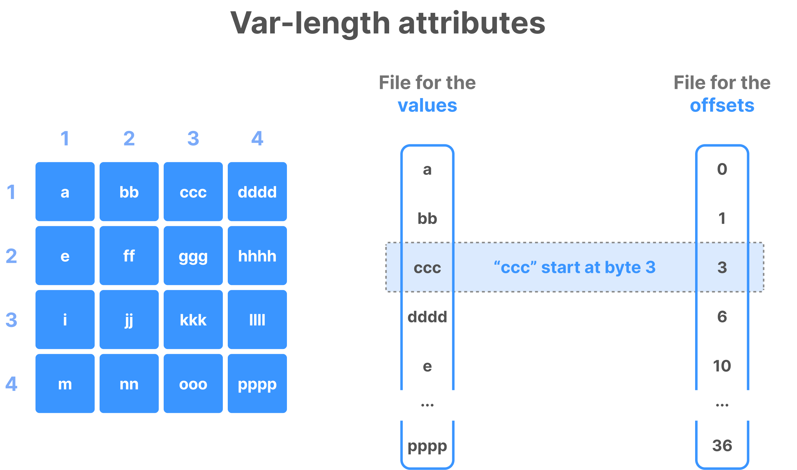
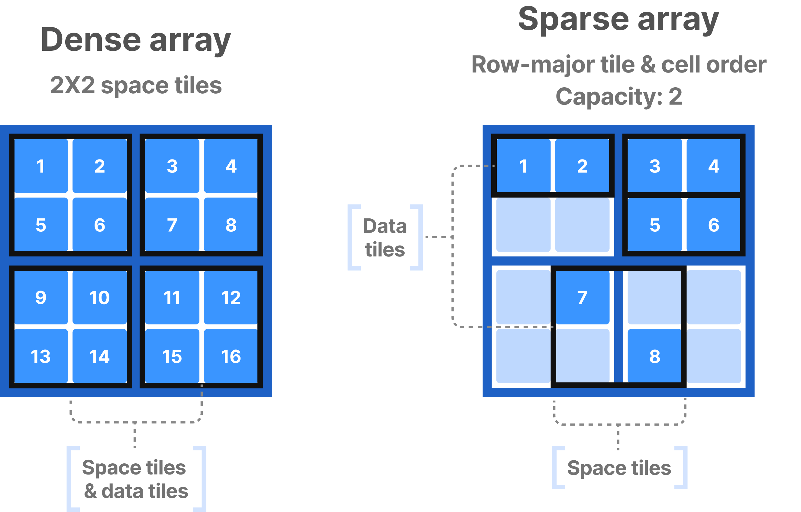
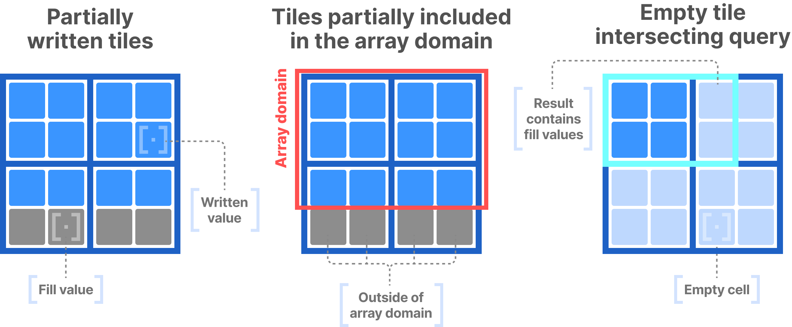

# Data Layout
#tiledb

The data layout dictates how coords and values of multi-dim cells
are serialized and stored in the inherently 1D storage files.

Summary of concepts:

Cell global order: the way cells are mapped into unique 1D order.

Columnar format: values of each attr, coords in sparse arrays,
and offsets of variable-length attrs are all stored in separate files.

Data tiles: groups of non-empty cells which serve as atomic unit of I/O and compression.

Fill values: How TileDB represents missing values for partially populated
tiles in dense arrays.

## Cell Global Order

Handled differently for dense and sparse arrays.

### Dense Array Cell Global Order

Global order is determined by three parameters by user upon array creation:
1. Tile extent per dimension (which partitions each dim into equal segments)
2. Tile order (can be either row- or column- major order)
3. Cell order (can be either row- or column- major order)

In an array with more than two dimensions:
Row-major means faster running index in the order is last dimension, e.g.
`[0,0,0], [0,0,1], [0,0,2], ...`
Col-major means faster running index in the order is the first dimension, e.g.
`[0,0,0], [1,0,0], [2,0,0], ...`

The combinations of different extent per dim, tile, and cell order lead to
different zig-zag patterns of global ordering:

### Sparse Array Cell Global Order

Global cell order is determined by following parameters upon array creation:
1. Either the same parameters as in dense arrays,
2. Or by using a Hilbert space-filling curve.

The Hilbert space-filling curve is kinda snakey kinda fractal.
The mapping between 1D and 2D space preserves locality fairly well.

In the latter case of the Hilbert, the user needs to specify:
- The domain of each dimension,
- The cell order as `hilbert` (ignores tile extents and tile order)

Note: The Hilbert curve is based on quantizing each dim domain,
and therefore is strongly affected by it.
(e.g. if domain too small, all cells may map to same Hilbert val, destroying locality)

## Columnar format

TileDB implements the so-called columnar format (adopted from analytical DBs).
This means that cell values across each attr are stored in separate files.

The same is true for cell coords in sparse arrays,
as well as offsets of variable-length attrs.

_All cells on all different files follow same global order._
Separate attr values at the same coords correspond to same file position.

And var-length attr values and their offsets correspond as well.

## Data tiles

I've noted this elsewhere.

Data tiles are the atomic unit of I/O and compression.

Data tiles in dense and sparse arrays are different:
- Dense: space tile (defined by extents of each dim) is the same as the data tile.
- Sparse: space tile and data tiles generally not the same because of empty cells.

With sparse, a capacity is specified upon creation,
which fixes the number of non-empty cells a data tile should contain.
TileDB determines cells correspondence to tiles based on global order,
packing non-empty cells in groups with size equal to specified capacity.

In both cases of sparse and dense,
a logical data tile encompasses only logical non-empty cells,
whereas physical data tile corresponds to non-empty cell values on 
a specific attr, dim (for sparse coords) or offset tile (for var-length attrs)

## Fill values

I've noted this elsewhere.

Applicable only to dense arrays, when data tiles are partially written.
Three cases:
1. user incrementally populates array, writing subarray such that it intersects certain tiles
2. array domain does not contain integral tiles
3. query subarray intersects empty tiles (or tiles with fill values)

For these, TileDB fills partial tiles or result with special fill values.
Practically, fill value represents non-empty cell in a dense array.

