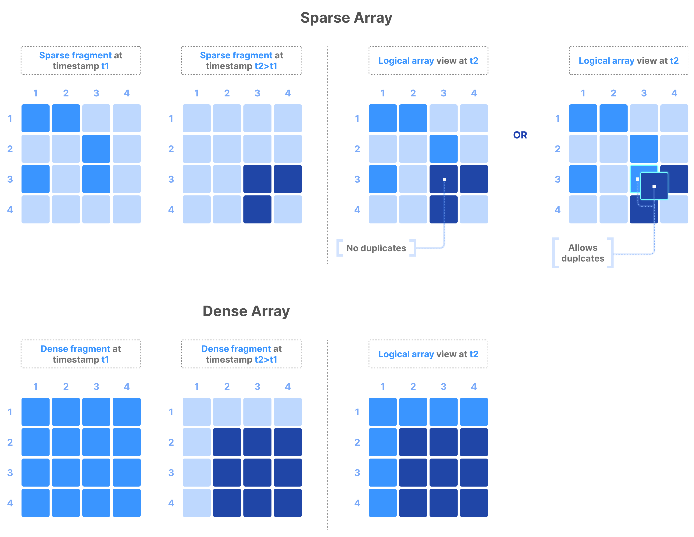

# TileDB Fragments
#tiledb #fragments

A fragment represents a timestamped write to a TileDB array.

The figure below shows writes performed on dense/sparse arrays at 2 timestamps,
`t1` and `t2` where `t2 > t1`.

The logical array view when the user reads at any timestamp `t3 >= t2`.
contains all the cells written in the array before `t3`,
with the more recent cells overwriting older cells.

In the special case of sparse arrays that accept duplicates,
(which can be specified in the array schema),
if a cell was written more than once,
all cell replicas are maintained and returned to the user upon reading.

Each fragment is a timestamped subfolder in the array folder's `__fragments/`.

It contains all separate files for each written attr (or sparse array coords).
It also stores a special file for fragment metadata,
which makes each fragment self-contained
(i.e. has all necessary info for efficient reads on fragments).

## LSM tree-like writing of Fragments

A Log-Structured Merge Tree (LSM) is a data structure used in DBs/storage.
Allows handling of large amounts of data efficiently,
even in scenarios involving high write throughput.
LSM trees write sequentially to disk, minimizing random writes,
and taking advantage of high performance of sequential disk I/O.
Data is organized into multiple levels,
each level containing larger, sorted, segments of data.
Tradeoff is increased read latency due to searching across multiple levels.

Fragments let TileDB implement an LSM-tree-like approach to writing,
where all generated files are immutable.
This is critical for performance, especially on object stores (S3, etc.)
where all files/objects are immutable as well.

However numerous write operations may lead to large number of fragments,
adversely impacting read performance.
To mitigate this, TileDB implements an efficient consolidation mechanism,
which consolidates multiple fragments into fewer fragments.

## Fragment metadata

Each fragment contains a special fragment metadata file inside its folder.
This file has necessary index info about fragment for efficient read ops

Some of this info includes:
- Number of total cells in fragment
- File offsets of each data tile for each attr and dim
- Aggregate info on each data tile
- Indexing info (such as R-tree in sparse arrays)

Over time, number of fragments in array increases with each write performed.
This can negatively impact performance.
TileDB supports consolidation of fragments and fragment metadata.
Consolidation of fragment metadata generates a consolidated file,
which combines the metadata of multiple fragments into one,
significantly boosting read performance.

## Commits

TileDB is architected so that writing is _atomic_ and _consistent_,
supporting multiple concurrent readers and writers.
This is possible via the concept of commit files,
which effectively allow TileDB to consider a fragment in a read operation
only if the corresponding write operation completed successfully.

Commits prevent TileDB from reading partially complete writes.
When a fragment is written, it's invisible to the read operations.
A read operation considers a fragment as complete only if a corresponding
commit file is written in the `__commits/` subfolder within the array folder.
The commit file is written by the write operation as the very last step,
and only when all the fragments have been successfully generated.
This guarantees write atomicity and consistency even if a fragment write
fails with partially written files

