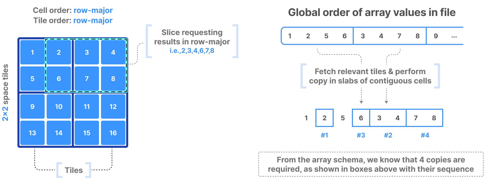
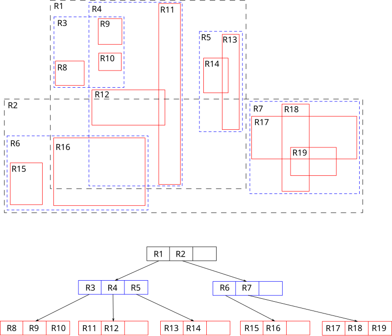

# TileDB Indexing
#tiledb

TileDB implements super optimized, multi-dim slicing via indexing.

## Dense array indexing

Along with slicing info returned by a query,
you also know the following from the array schema:
The num of dims, global order, tiling, and that there are no empty cells.

Usingly solely the array schema with basic arithmetic and no extra index,
you can calculate the number, size, and location of _cell slabs_,
which are the sets of contiguous cells on disk that form the query result.

TileDB's multi-threaded algorithm, in parallel:
1. fetches relevant tiles from disk,
2. decompresses the cell slabs,
3. and copies the cell slabs into result buffers

For the following example (cell and tile order is row-major):
A slice requests results in row-major, 2 through 8 (2x3  selection).
We fetch the two tiles (first two) that contain these cells.
2 and 6 are in the 1st tile but are non-contiguous (different slabs).
3, 4, 7, 8 are in the 2nd tile contiguously (same slab or different slabs?)
Since we need to deliver results in order, we copy four times:
1. `2`
2. `3` and `4`
3. `6`
4. `7` and `8`

## Sparse array indexing

Slicing in sparse arrays is more difficult,
since we do not know the location of empty cells until the array is written.

Therefore, unlike dense arrays,
TileDB needs to explicitly store coords of non-empty cells,
and build an index on top of them.
The index must be small in size to load quickly into main memory
when a query is submitted.

TileDB uses an R-tree as an index.
R-trees are a balanced tree data structure used for spatial access.
"R" stands for rectangle.
The key idea is to group nearby objects and represent them with
their minimum bounding rectangle (MBR), object's min to max x and y coords,
in the next higher level of the tree.
MBRs can overlap, and a query at the intersection 
can cause overlapping subtrees to have to be searched.

In TileDB, the R-tree groups the non-empty cells into MBRs, one per tile,
and then recursively groups those MBRs into a tree structure.

In the example below, the slicing algorithm traverses the R-tree
to find which tile MBRs overlap the query and fetches + decompresses them.
For every partially overlapping tile, the algo further checks the coords
one by one to determine whether they fall within the query slice.
Multi-threading and vectorization lead to efficient multi-dim slicing.

