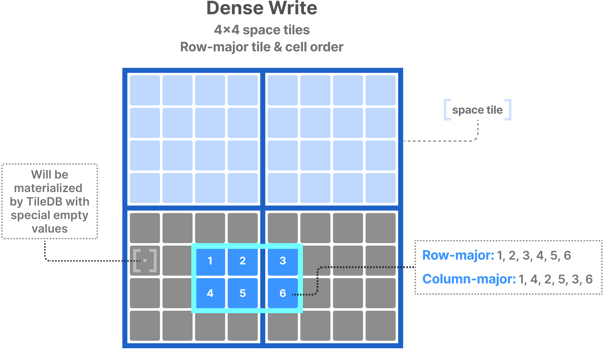
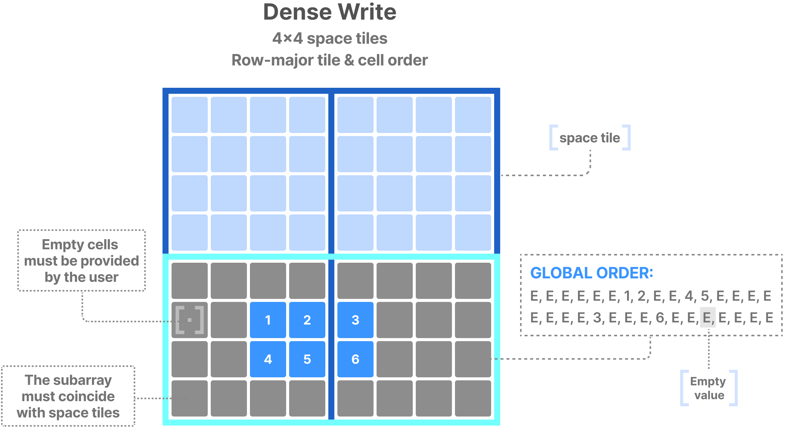
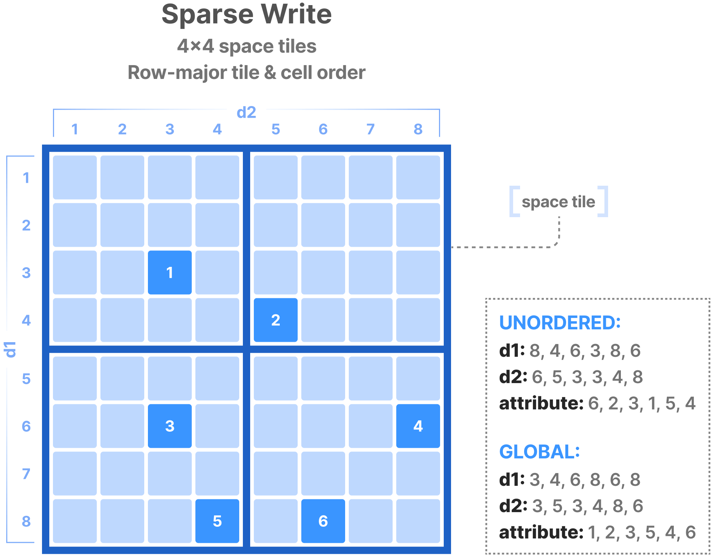

# TileDB Writes 
#tiledb #writes #commits

TileDB supports:
- Object stores (immutable objects, no updating in-place)
- Parallel batch writes (multi-thread/-process writing collections of cells)

Each write op creates one or more dense/sparse timestamped fragments.
Can process multiple write ops to populate an array,
or to overwrite cells in an array.

TileDB handles each write separately, without any locking.
Each fragment is immutable (i.e. write op only creates new fragments)

## Dense writes

Dense writes creates one or more dense fragments.

The user provides:
- Subarry to write into (single-rangle)
- Attr value of the cells being written to
- (some APIs only) cell order within subarray

For the specified cell order, it must be common across all attrs.
This is so that TileDB knows correspondence of values to cells in array domain.
The cell order may be row-major, column-major, or global.

### Row-major and column-major writes

In this example:

We write into 2x3 subarray of an array with a single attribute.
The figure depicts order of attrs for row- and col-major cell order.
```
1, 2, 3, 4, 5, 6  # Row-major
1, 4, 2, 5, 3, 6  # Column-major
```
TileDB appropriately organizes user-provided values to obey global cell order,
before storing them to disk.

TileDB always stores integral space tiles to disk,
therefore it will inject special fill values into user data 
to create full data tiles for each space tile.



### Global order writes

Writing in array global order needs a bit more care.
Subarray must be specified to coincide with space tile boundaries,
even if user wishes to write only in a smaller area within the subarray.
The user is responsible for adding empty cell values to their buffer.

In this example:

User wishes to write into 2x3 subarray that is smaller than tile boundaries.
User must expand their subarray to coincide with the two space tiles.
User must provide all cell values in the global order as a result,
following the tile order of the space tiles and the cell order within each.



This requires knowledge of space tiling and cell/tile order,
making it rather cumbersome to use.
However, this write mode leads to the best performance,
since TileDB doesn't need to organize cells along global order.
It is recommended for use cases where data arrive already grouped
according to space tiling and global order (e.g. geospatial).

## Sparse writes

Creates one or more sparse fragments.

User must provide:
- attribute values to be written
- coords of cells to be written
- (Some APIs) cell layout of attr and coord values (unordered or global order)

Sparse writes do not need to be constrained in a subarray,
since they contain the explicit coords of cells to write into.

In this example of unordered and global cell orders:

Unordered:
```
d1:   8, 4, 6, 3, 8, 6
d2:   6, 5, 3, 3, 4, 8
attr: 6, 2, 3, 1, 5, 4
```

Global:
```
d1:   3, 4, 6, 8, 6, 8
d2:   3, 5, 3, 4, 8, 6
attr: 1, 2, 3, 5, 4, 6
```

Unordered is easiest and most typical.
TileDB organizes cells along global order internally before writing to disk.
Global order is more efficient, but more cumbersome,
since user must know space tiling and tile/cell order of array,
manually sorting the values before providing them.



## Commits

TileDB support multiple writer, multiple reader model.
Ensures ongoing writes don't interfere with concurrent writes or reads.
Commits enable this! Read about them in [[08 Fragments#Commits]].

## Consolidation

Many immutable writes lead to degradation of read performance,
due to the numerous fragments they create.

To mitigate this, TileDB supports advanced consolidation techniques.
This helps compact multiple fragments into a single one,
potentially significantly boosting read performance.

Read more in [[08 Fragments]].
